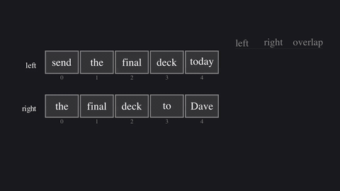

# Long-form Audio Chunking for STT Providers

# Quickstart
Refer to [benchmark](benchmark/README.md) and [pipeline](pipeline/README.md) for more information.

Both entry points require a few non-Python dependencies:

- `ffmpeg` and `ffprobe` on `PATH` for audio normalization, duration probing, and chunk slicing.
- `uv` for Python dependency management.
- An STT provider API key before transcribing. The benchmark accepts `OPENAI_API_KEY`; the pipeline also defaults to `OPENAI_API_KEY` for `avalon-1.5`.

To start the benchmark:

```bash
cd benchmark
uv venv
uv sync --project .
export OPENAI_API_KEY=...
```

```bash
uv run --project . benchmark.py                                           # all 3 datasets, defaults
uv run --project . benchmark.py ami                                       # one dataset
uv run --project . benchmark.py --chunk-seconds 300 --overlap-seconds 10  # optional; default is 300s (5 min)
uv run --project . benchmark.py --chunk-seconds 600 --overlap-seconds 10  # 10 min chunks
```

To start the ETL pipeline:

```bash
cd pipeline
uv sync
mkdir -p audio_files
export OPENAI_API_KEY=...
uv run python main.py
```

# Motivation
The motivation for this project originated in an OSS contribution I made some time ago ([PR #1889](https://github.com/cocoindex-io/cocoindex/pull/1889)) to CocoIndex, an AI-native ETL pipeline. My goal was to add STT as a first-class primitive to the core transformation offering. However, after raising the related issue, I received an interesting comment—specifically, on [issue #1828](https://github.com/cocoindex-io/cocoindex/issues/1828#issuecomment-4239022518). In short, I learned that STT model providers are generally subject to a set of constraints relevant to my goals. I opted for an unopinionated API that extended the existing LiteLLM provider for embeddings (my reasoning is [here](https://github.com/cocoindex-io/cocoindex/pull/1889#issue-4326648116)). Especially in the context of CocoIndex (which aims to be a 'context engine for your agents'), it is reasonable to assume that a *useful* STT transformation generally needs to support some kind of long-form audio. So, I leaned into that idea and decided to extend my work into a proper project.

---

# Outline
The project has two main components: `/benchmark` and `/pipeline`.

### Benchmark
The benchmark is intended to offer a common substrate for investigating different chunking strategies and is extensible to other datasets as well (see [Clanker.md](benchmark/datasets/CLANKER.md) for instructions). Currently, the benchmark supports three different corpora (AMI, ICSI, and Earnings22), representing a good sample for the actual pipeline (long-form, professional audio recordings).

### Pipeline
The pipeline itself is an amalgamation of findings from the benchmark (and some educated guesses), and supports an 'intelligent' chunking algorithm. It can be extended and can act as both an intermediate step or as the full processing pipeline (CocoIndex offers many source/target connectors: S3 buckets, Google Drive, databases, etc.).

##### Why the pipeline (and CocoIndex in the first place)?
There are a vast number of off-the-shelf meeting transcription/summarization services that work well enough not to justify building another one. What I find interesting about CocoIndex (and the transcription part of the loop) is its modularity and open source nature: you *could* use a proprietary service that meets your business needs, but then you're locked to the vendor and their workflows/APIs. With CocoIndex, the STT service can run in parallel with workflows that pull data from sources like Slack, Google Drive, a database, and synthesize insights and fresh context about daily operations, which closely resembles YC's recent 'company brain' pitch in their latest request for startups.

# Results

End-to-end benchmark (`benchmark.py`), using **Aqua Voice `avalon-v1.5`** and overlaps merged via LCS stitching. The table below shows one **`evaluation/tests`** snapshot on the checked-in data under `benchmark/data/prepared/benchmark/` (refs vs hyps). **Chunking differs by corpus** for this run: **AMI** and **Earnings22** used 300 s segments with 10 s overlap in MP3; **ICSI** was re-chunked and re-transcribed at 150 s / 10 s overlap in WAV after provider timeouts on longer MP3 uploads.

| Dataset | Case | Chunking (length / overlap / format) | WER | Word acc. | Edit distance | Semantic |
| --- | --- | --- | ---: | ---: | ---: | ---: |
| earnings22 | 4462231 | 300 s / 10 s / MP3 | 18.43% | 81.57% | 1330 | 0.992 | 
| earnings22 | 4469528 | 300 s / 10 s / MP3 | 22.71% | 77.29% | 844 | 0.883 | 
| icsi | Bmr001 | 150 s / 10 s / WAV | 40.04% | 59.96% | 2565 | 0.882 | 
| icsi | Bns001 | 150 s / 10 s / WAV | 29.80% | 70.20% | 4516 | 0.600 | 
| icsi | Bro003 | 150 s / 10 s / WAV | 25.50% | 74.50% | 3276 | 0.369 | 
| ami | EN2001a | 300 s / 10 s / MP3 | 18.39% | 81.61% | 2980 | 0.917 | 
| ami | ES2008a | 300 s / 10 s / MP3 | 77.77% | 22.23% | 1963 | 0.316 | 
| ami | ES2008b | 300 s / 10 s / MP3 | 16.98% | 83.02% | 1022 | 0.973 | 

You can reproduce these results with [benchmark/README.md](benchmark/README.md); use `--resume-transcribe` with `--skip-chunk` when only some corpora need re-transcription.

# Discussion
In the spirit of scholarly diligence, I wanted to try as many different chunking strategies as possible. After some experimentation and deliberate thought, it became clear that the domain I wanted to focus on (professional audio) requires aggressive/redundant context preservation. Therefore, the most appropriate strategy involves some form of chunking with overlaps, prompting me to construct the following table:

**API overhead (%):** Extra audio volume across chunking strategies.

| Chunk **N** \ Overlap **M** | 5s | 10s | 15s | 20s | 30s |
| --- | ---: | ---: | ---: | ---: | ---: |
| 3 min (180s) | 5.56% | 11.11% | 16.67% | 22.22% | 33.33% |
| 5 min (300s) | 3.33% | 6.67% | 10.00% | 13.33% | 20.00% |
| 10 min (600s) | 1.67% | 3.33% | 5.00% | 6.67% | 10.00% |
| 15 min (900s) | 1.11% | 2.22% | 3.33% | 4.44% | 6.67% |
| 18 min (1080s) | 0.93% | 1.85% | 2.78% | 3.70% | 5.56% |

When overlapping **M** seconds on a timeline, each internal boundary is transcribed twice. Compared to sending the same timeline with **no overlap**, the steady-state extra audio per chunk relative to chunk length **N** is **(2M/N)×100**.

By examining the table above, you can decide what level of overhead is acceptable in a production environment. One tradeoff not obvious from this table is that, depending on the STT provider, transcription accuracy can degrade as chunks become longer (context degradation). In my experiments, I found that 10:10 (3.33% overhead) and 15:10 (2.22%) were reasonable values for context preservation across boundaries.

### Deduping transcripts
One minor drawback of the overlapping chunks strategy is that the resulting transcription will inevitably include duplication. I opted for a longest common subsequence algorithm to resolve duplications. For fun, I made a small animation (using [Manim](https://github.com/3b1b/manim)) to show how it works:



In principle, what happens is the following:
1. Slide subsequences of varying length across the adjacent chunks.
2. During iteration, check for *best* alignment (the largest number of positional matches).
3. Merge them along the middle.


### Hybrid chunking strategy
The default `hybrid` strategy for the pipeline:

1. Checks whether the input can be reused. By default, the pipeline writes a
   normalized 16 kHz mono FLAC. If normalization is disabled and the input is
   already a 16 kHz mono FLAC, it can be reused without transcoding.
2. Runs Silero VAD over that prepared FLAC. If VAD detects no speech segments,
   the transcript is stored as an empty string and transcription is skipped.
3. Sends the prepared FLAC directly if it is under 25 MB and shorter than 18
   minutes.
4. Otherwise, uses VAD output to find natural silence boundaries of
   at least 10 seconds.
5. Splits greedily on those silence boundaries while keeping each chunk at most
   10 minutes.
6. Falls back to a 10-minute cut when no suitable silence boundary exists before
   the limit.

## Notes
- You will notice that the benchmark makes no mention of [Silero VAD](https://github.com/snakers4/silero-vad). Due to the corpora metadata format, it was challenging to align transcripts with chunks (and hence evaluate the results), so I didn't benchmark the full strategy used by the pipeline. I chose to use it in the pipeline because it provides a form of pre-processing that can make the chunking strategy more informed (chunking at appropriate silence boundaries).

- For both the benchmark and the pipeline, I normalize the audio to 16 kHz mono FLAC, both for consistency in results and for the benefits of free lossless compression.
